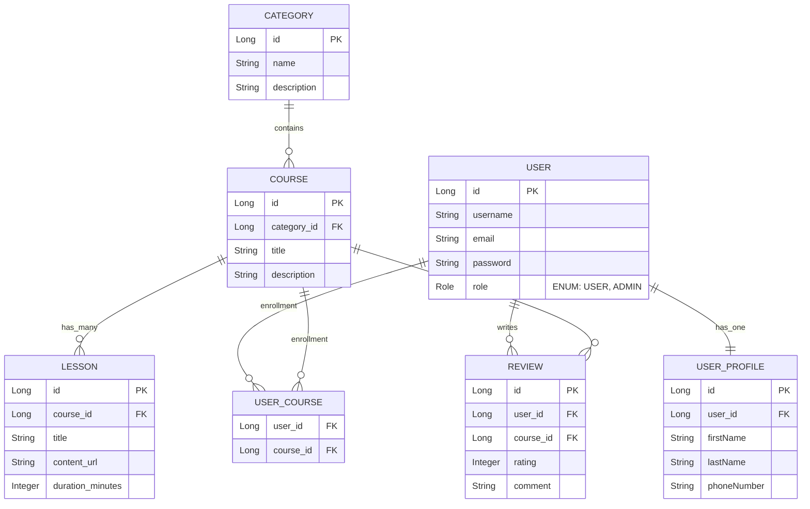
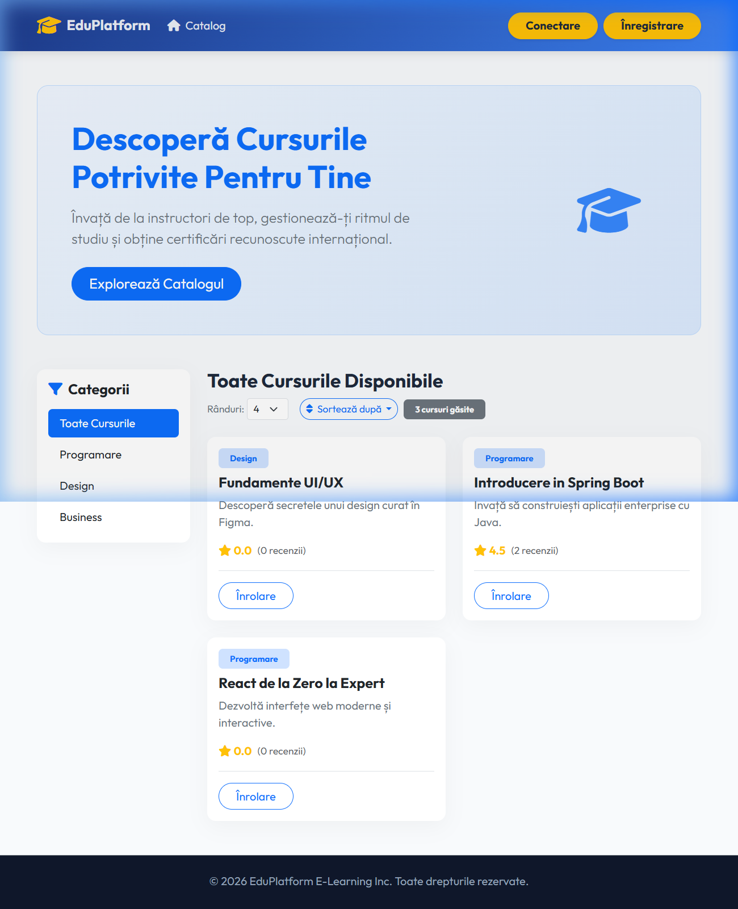
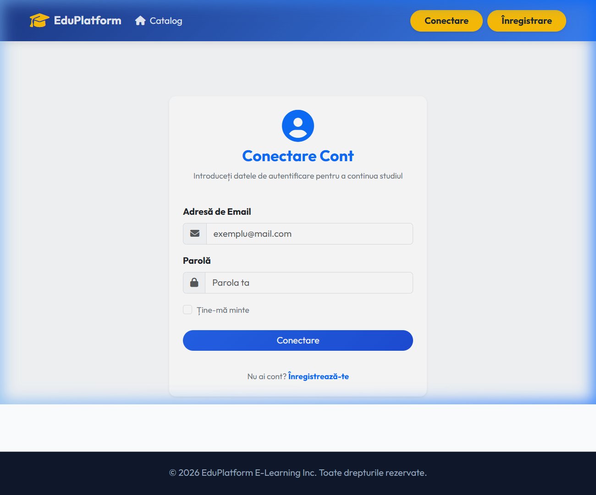
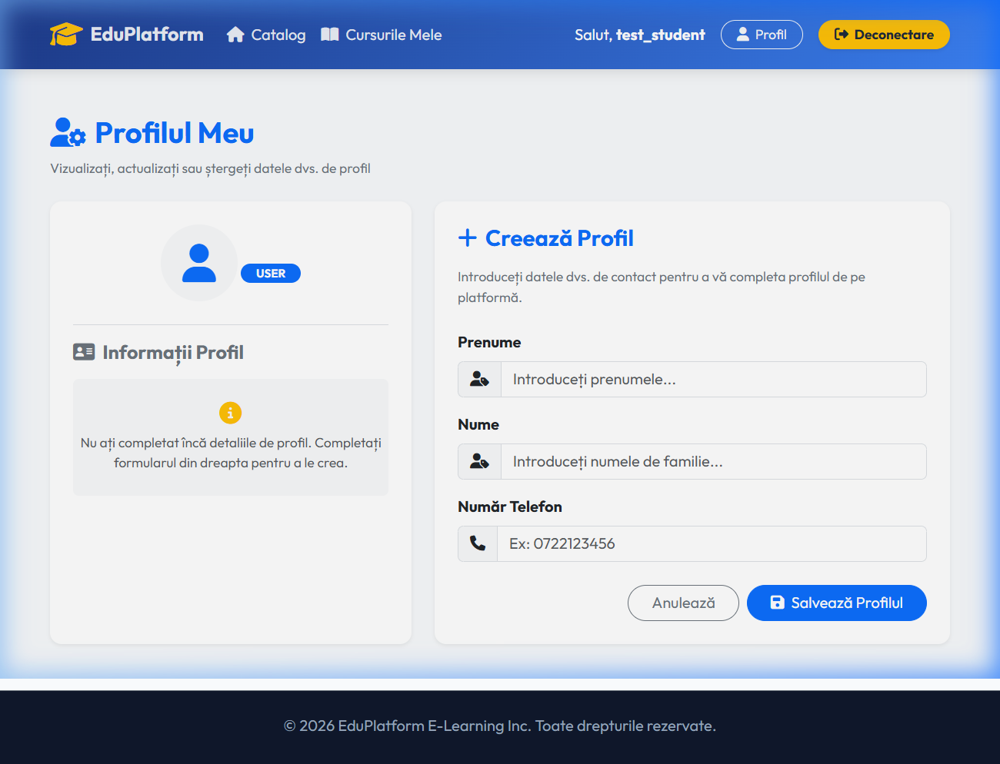
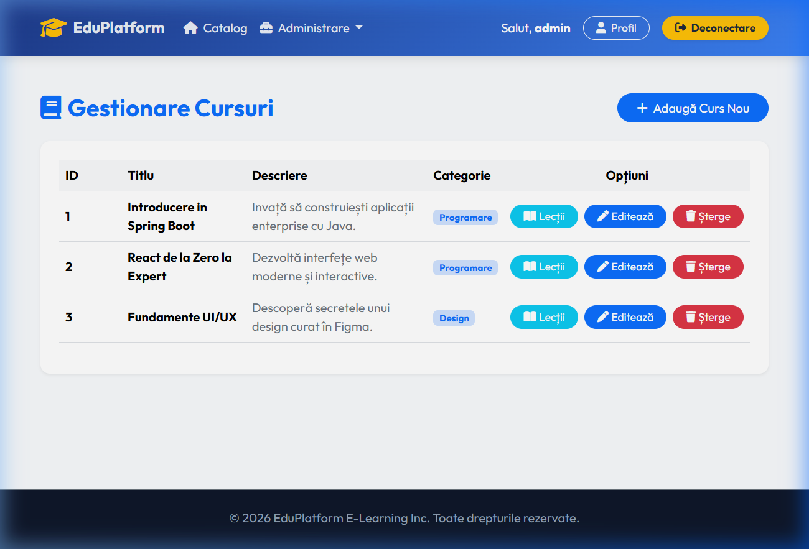

# 🎓 EduPlatform - Platformă de E-Learning

[](https://spring.io/projects/spring-boot)
[](https://spring.io/projects/spring-security)
[](https://www.thymeleaf.org)
[](https://www.mysql.com)
[](http://www.h2database.com)
[](https://getbootstrap.com)

---

## 📝 1. Descrierea Proiectului
EduPlatform este o aplicație web modernă destinată cursurilor online (similară cu Udemy/Coursera). Platforma permite instructorilor/administratorilor să creeze și să gestioneze categorii, cursuri și lecții, iar studenților să exploreze catalogul, să se înroleze la cursuri, să vizualizeze lecțiile și să ofere recenzii detaliate (rating + comentariu).

### Caracteristici:
* **Securitate:** Autentificare și autorizare bazate pe roluri (`USER`, `ADMIN`), mecanism de „Remember Me” și protecție CSRF.
* **Aspect Modern:** Interfață dinamică realizată în **Thymeleaf**, stilizată cu **Bootstrap 5**.
* **Sistem de Recenzii:** Studenții înrolați pot lăsa recenzii (CRUD complet).
* **Filtrare, Căutare și Paginație:** Catalog interactiv pe pagina principală cu paginare dinamică, sortare alfabetică sau după rating, și filtrare rapidă după categorii.
* **Monitorizare AOP:** Logare centralizată a metodelor din pachetul de servicii folosind **AspectJ**, monitorizând timpul de execuție, argumentele și erorile de business.

---

## 🏛️ 2. Arhitectură și Modelul Bazei de Date

Aplicația respectă arhitectura clasică **3-Tier Layered Architecture**:
1. **Presentation Layer (Web)**: Controlerele Spring MVC (`*WebController`) ce servesc pagini Thymeleaf dinamice și interacționează cu utilizatorul.
2. **Business Service Layer**: Logica de business (`*ServiceImpl`), validarea datelor și maparea automată a entităților prin DTO-uri utilizând **ModelMapper**.
3. **Data Access Layer (Repository)**: Interfețe Spring Data JPA ce efectuează operațiuni asupra bazei de date folosind query-uri custom derivate sau JPQL (de ex. calculul mediei ratingului în timp real).

### Diagrama ERD (Entity-Relationship Diagram)



---

## 🚀 3. Instrucțiuni de Setup (Instalare)

### Cerințe minime:
- **Java JDK 17** sau mai recent (proiectul rulează pe JDK 17/21/26)
- **Maven 3.6+** (sau wrapper-ul inclus `mvnw`)
- **MySQL Server** (pentru profilul de dezvoltare `dev`)

### Pasul 1: Configurarea Bazei de Date (MySQL)
Pentru a rula aplicația cu profilul implicit de dezvoltare (`dev`), asigurați-vă că aveți un server MySQL pornit și executați comanda:
```sql
CREATE DATABASE awbd;
CREATE USER 'awbd'@'localhost' IDENTIFIED BY 'awbd';
GRANT ALL PRIVILEGES ON awbd.* TO 'awbd'@'localhost';
FLUSH PRIVILEGES;
```
*Notă: Setările de conexiune se regăsesc în [application-dev.yml](platform/platform/src/main/resources/application-dev.yml).*

### Pasul 2: Pornirea aplicației

#### Opțiunea A: Rularea în regim de dezvoltare (MySQL)
Din directorul `platform/platform`, porniți serverul folosind:
```bash
./mvnw spring-boot:run
```

#### Opțiunea B: Rularea cu baza de date H2 în memorie (Fără MySQL)
Dacă doriți să testați aplicația instant, fără a configura MySQL, puteți folosi profilul `test` care pornește baza de date H2 în memorie și inserează automat date mock:
- **Windows (PowerShell):**
  ```powershell
  $env:SPRING_PROFILES_ACTIVE="test"
  ./mvnw spring-boot:run
  ```
- **Linux / macOS:**
  ```bash
  SPRING_PROFILES_ACTIVE=test ./mvnw spring-boot:run
  ```

Aplicația va fi accesibilă la adresa: **`http://localhost:8080/web/home`**.
Consola H2 (dacă folosiți profilul `test`): `http://localhost:8080/h2-console` (JDBC URL: `jdbc:h2:mem:testdb`, User: `sa`, Fără parolă).

### Pasul 3: Rularea Testelor
Pentru a rula întreaga suită de teste (inclusiv testele de integrare E2E):
```bash
./mvnw clean test
```

---

## 🔌 4. Documentație API (Rute & Endpoint-uri)

Toate rutele web sunt mapate sub prefixul `/web` și necesită rolurile specificate mai jos.

### Rute Publice (Vizitatori)
| Metodă | Endpoint | Descriere |
| :--- | :--- | :--- |
| `GET` | `/web/home` | Catalog cursuri cu paginare, sortare și filtrare categorii |
| `GET` | `/web/auth/login` | Formular de autentificare în cont |
| `GET` | `/web/auth/register` | Formular de creare cont student |
| `POST`| `/web/auth/register` | Procesarea înregistrării studentului |
| `GET` | `/web/auth/access-denied`| Pagina afișată în cazul accesului neautorizat (403) |

### Rute Student (Rol: `USER`)
| Metodă | Endpoint | Descriere |
| :--- | :--- | :--- |
| `GET` | `/web/profile` | Vizualizarea și editarea profilului personal |
| `POST`| `/web/profile/save` | Salvarea datelor din profil (Nume, Prenume, Telefon) |
| `POST`| `/web/profile/delete` | Ștergerea profilului personal |
| `GET` | `/web/courses/my-courses` | Afișarea listei cursurilor la care studentul este înrolat |
| `POST`| `/web/courses/{id}/enroll` | Înrolarea la un curs din catalog |
| `GET` | `/web/courses/{courseId}/lessons` | Vizualizarea lecțiilor aferente cursului (doar pentru cei înrolați) |
| `GET` | `/web/reviews/create/{courseId}`| Formular pentru adăugarea unei recenzii |
| `POST`| `/web/reviews/save/{courseId}` | Salvarea recenziei (rating între 1 și 5 + comentariu) |
| `GET` | `/web/reviews/edit/{id}` | Editarea unei recenzii scrise anterior |
| `GET` | `/web/reviews/delete/{id}` | Ștergerea recenziei personale |

### Rute Administrare (Rol: `ADMIN`)
| Metodă | Endpoint | Descriere |
| :--- | :--- | :--- |
| `GET` | `/web/admin/courses` | Managementul cursurilor (Listare/Editare/Ștergere) |
| `GET` | `/web/admin/courses/create` | Formular pentru crearea unui curs nou |
| `GET` | `/web/admin/courses/edit/{id}`| Formular pentru editarea unui curs existent |
| `POST`| `/web/admin/courses/save` | Salvarea modificărilor sau crearea cursului |
| `GET` | `/web/admin/courses/delete/{id}`| Ștergerea cursului din baza de date |
| `GET` | `/web/admin/categories` | Managementul categoriilor |
| `GET` | `/web/admin/categories/create`| Formular de creare categorie |
| `POST`| `/web/admin/categories/save` | Salvarea categoriei create/editate |
| `GET` | `/web/admin/categories/delete/{id}`| Ștergerea categoriei |
| `GET` | `/web/admin/users` | Listarea și managementul utilizatorilor și a rolurilor |
| `POST`| `/web/admin/users/save` | Editare detalii conturi utilizatori de către admin |
| `GET` | `/web/admin/users/delete/{id}`| Ștergerea unui cont de utilizator |
| `GET` | `/web/admin/reviews` | Vizualizarea tuturor recenziilor scrise pe platformă |
| `GET` | `/web/admin/reviews/delete/{id}`| Moderare și ștergere recenzii neconforme |
| `GET` | `/web/admin/lessons/create/{courseId}`| Formular adăugare lecție nouă la un curs |
| `GET` | `/web/admin/lessons/edit/{id}`| Formular editare lecție |
| `POST`| `/web/admin/lessons/save` | Salvarea/actualizarea lecției |
| `GET` | `/web/admin/lessons/delete/{id}`| Ștergerea lecției |

---

## 📸 5. Screenshots (Imagini din Aplicație)

| Catalog Cursuri (Acasă) | Ecran de Autentificare |
| :---: | :---: |
|  |  |

| Profil Student | Panou Administrare Cursuri (Admin) |
| :---: | :---: |
|  |  |

---

## 👥 6. Contribuții Membrii Echipei

### 👩‍💻 Bobic Teona-Christiana
- **Arhitectura Backend**: Dezvoltarea controlerelor web (`*WebController`), structurilor DTO și mapărilor (`*Mapper`) utilizând ModelMapper.
- **Securitate**: Configurarea Spring Security (Spring SecurityFilterChain, pagini de login/register customizate, remember-me persistent, gestiunea rolurilor și autorizarea endpoint-urilor).
- **Interfață Utilizator**: Crearea paginilor dinamice cu Thymeleaf, structurarea layout-ului global și integrarea elementelor vizuale premium (Bootstrap 5, google fonts, gradienți).
- **Documentare**: Redactarea ghidului tehnic.

### 👨‍💻 Buzatu Doru-Mihai
- **Pregătirea Proiectului**: Inițializarea proiectului prin Spring Initializr, setarea structurii de directoare, configurarea dependințelor în `pom.xml` și instalarea wrapper-ului Maven.
- **Design & Scripturi DB**: Maparea relațiilor dintre tabele în Hibernate, redactarea scripturilor de inițializare a bazei de date și seeding pentru MySQL și H2 (`schema-*.sql`, `data-*.sql`).
- **Testare și E2E**: Dezvoltarea testelor unitare de servicii și a suitei de teste de integrare cap-la-cap (`E2EIntegrationTests`), acoperind scenariile critice (înregistrare, securitate rating bounds, etc.).
- **Monitorizare AOP**: Implementarea aspectului de logging centralizat (`LoggingAspect`) pentru urmărirea execuțiilor de servicii și gestiunea excepțiilor.
